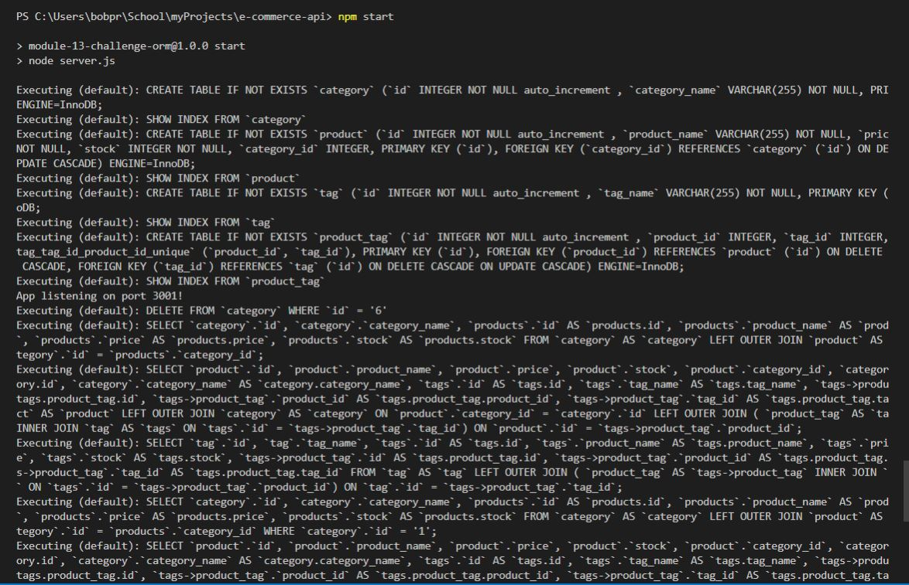

# E-Commerce Backend

<!-- TABLE OF CONTENTS -->

  
Table of Contents

  <ol>
    <li><a href="#description">Description</a></li>
    <li><a href="#user-story">User Story</a></li>
    <li><a href="#built-with">Built With</a></li>
    <li><a href="#maintainer">Contributing</a></li>
    <li><a href="#license">License</a></li>
    <li><a href="#video-link">Video Link</a></li>
    <li><a href="#screenshot">Screenshot</a></li>
  </ol>

## Description

Internet retail, also known as e-commerce, is the largest sector of the electronics industry, having generated an estimated US$29 trillion in 2017 (Source: United Nations Conference on Trade and Development). E-commerce platforms like Shopify and WooCommerce provide a suite of services to businesses of all sizes. Due to the prevalence of these platforms, developers should understand the fundamental architecture of e-commerce sites.

Your challenge is to build the back end for an e-commerce site. You’ll take a working Express.js API and configure it to use Sequelize to interact with a MySQL database.

## User Story

AS A manager at an internet retail company
I WANT a back end for my e-commerce website that uses the latest technologies
SO THAT my company can compete with other e-commerce companies

## Built-with

JavaScript, Node, NPM, express.js, sequalize

## Maintainer

<a href="mailto:bobpruz@gmail.com">Email: Robert Prusinowski</a>

## License

## Video Link

<a href="https://drive.google.com/file/d/1OlCkUevXEUypdFscYoNugRH22xZS4pPk/view?usp=sharing">Link to Video</a>

## Screenshot

